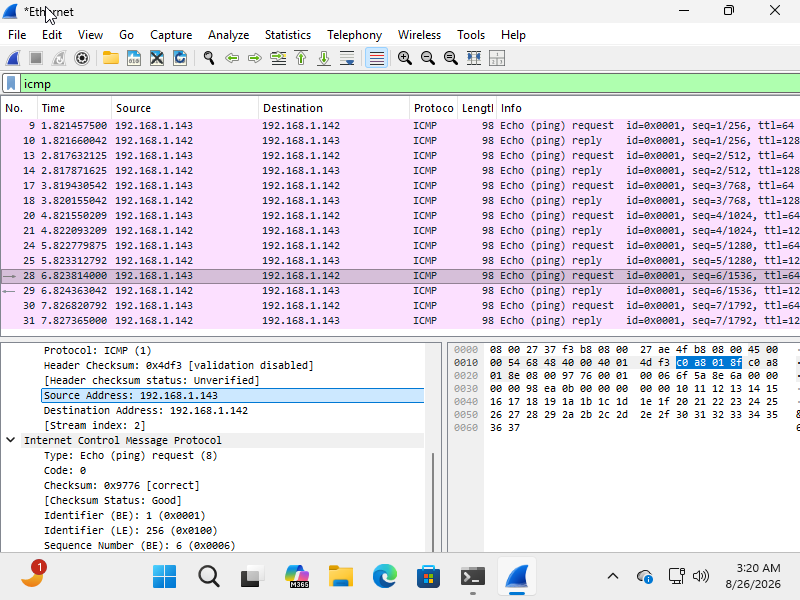
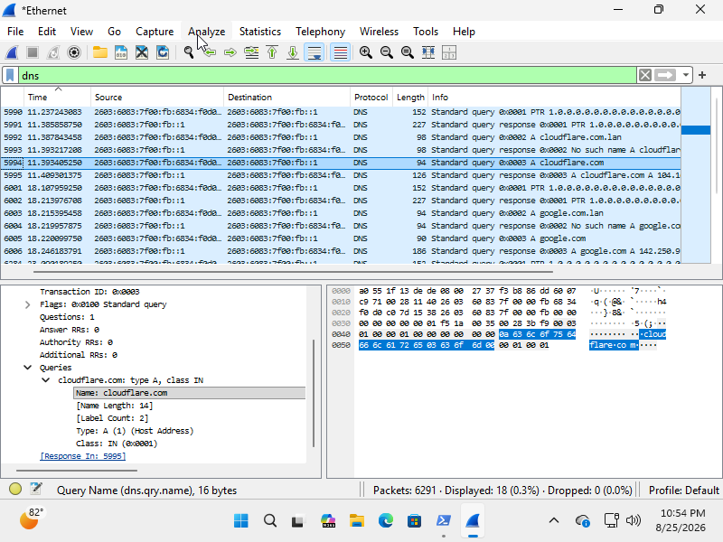
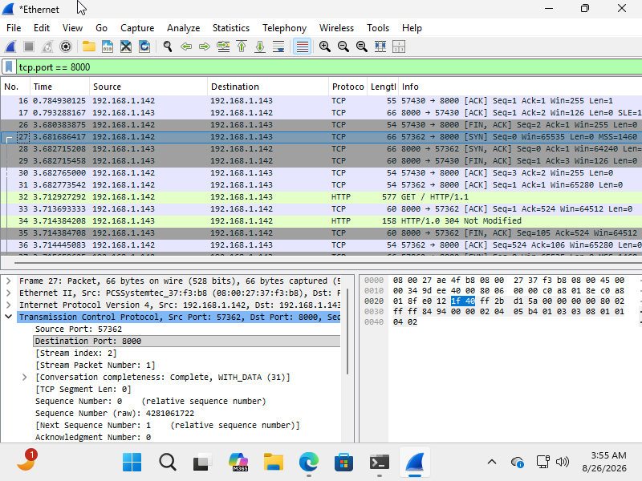
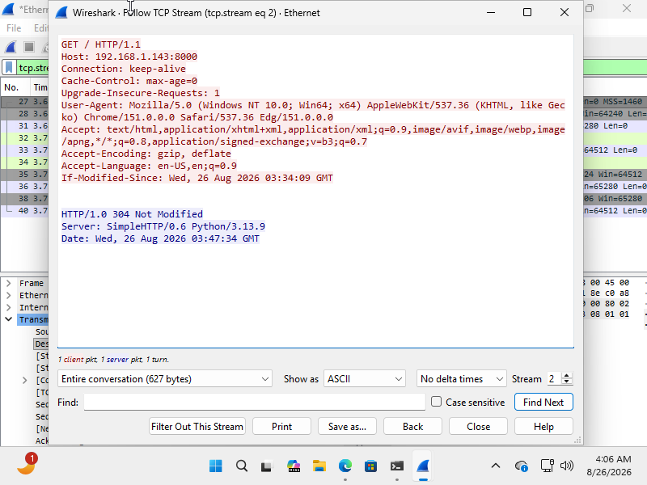
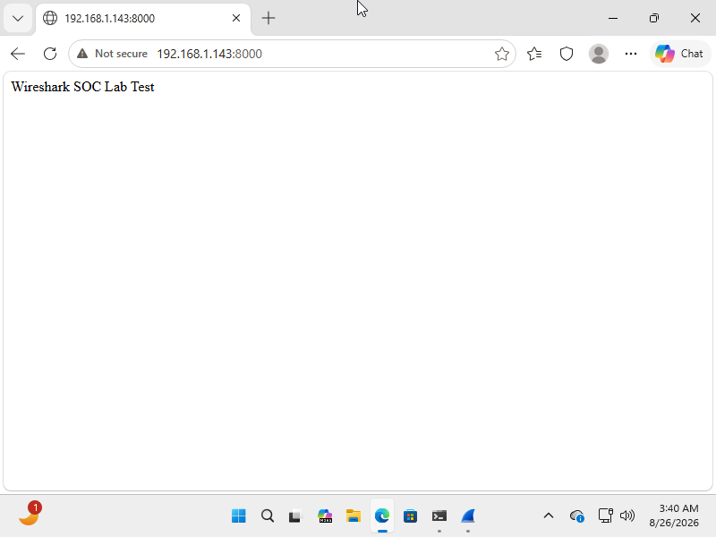
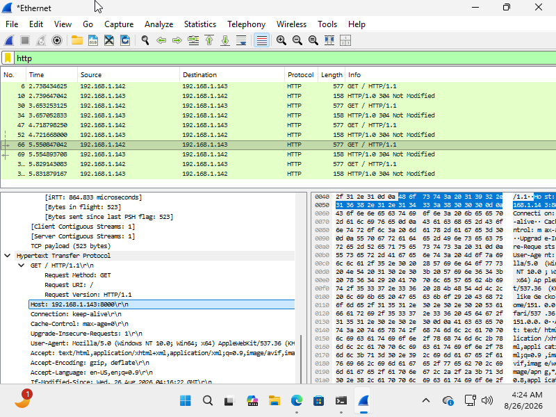
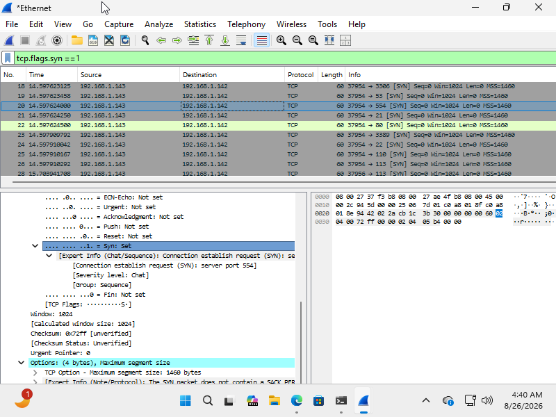
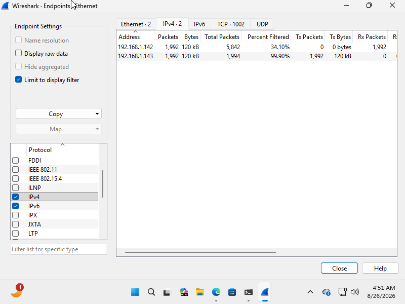

# Network Traffic Analysis & Investigation Lab
## Overview

This project demonstrates a hands-on network traffic analysis and investigation workflow using Wireshark in a controlled Windows 11 and Kali Linux virtual environment.

The project focuses on capturing and analyzing network traffic, identifying protocols and communicating endpoints, investigating DNS and HTTP communication, analyzing TCP connections, and detecting simulated network reconnaissance activity.

All activities were performed within a controlled virtual lab environment.

---
## Objective

- Capture network traffic using Wireshark  
- Analyze ICMP traffic and verify network connectivity  
- Investigate DNS queries and responses   
- Analyze TCP communication and connection establishment    
- Inspect HTTP application traffic  
- Identify communicating network endpoints      
- Detect simulated network reconnaissance activity    
- Apply packet-level analysis techniques  
- Interpret network traffic and security-related activity   
- Document findings using a SOC investigation approach 

---
## Lab Environment

| Component | Purpose |
|---|---|
| Windows 11 VM | Monitored endpoint |
| Kali Linux VM | Analyst / traffic-generation system |
| VirtualBox | Virtual lab environment |
| Wireshark | Network traffic capture and analysis |
| Nmap | Controlled reconnaissance simulation |
| Python HTTP Server | Controlled HTTP traffic generation |


### Lab Architecture


```text
              VirtualBox Lab

        ┌─────────────────────┐
        │     Windows 11 VM   │
        │  Monitored Endpoint │
        └──────────┬──────────┘
                   │
                SOC-LAB
             Network
                   │
        ┌──────────┴──────────┐
        │                     │
        │    Kali Linux VM    │
        │ Analyst / Tester    │
        └─────────────────────┘
```
---
 

## Investigation

### 1. ICMP Analysis

ICMP traffic was generated between the Windows and Kali virtual machines to verify network connectivity.
The traffic was analyzed in Wireshark to identify Echo Requests and Echo Replies and to examine the source and destination endpoints.
#### 🔍 Wireshark Filter
```text
 icmp
```
 

ICMP Echo Request and Echo Reply traffic was successfully observed between the lab endpoints, confirming network connectivity within the virtual environment.

---

### 2. DNS Investigation

DNS traffic was generated using nslookup and analyzed in Wireshark.
Several domains were queried during the investigation, including cloudflare.com and google.com.
#### 🔍 Wireshark Filter
```text
dns
```
```text
dns.qry.name
```
To focus on a specific domain:
```text
dns.qry.name contains "cloudflare"
```


DNS queries and responses were successfully captured and analyzed. The observed traffic represented normal domain name resolution activity. No malicious DNS activity was confirmed from the analyzed traffic.

---

### 3. TCP Analysis

TCP communication was analyzed between the Windows endpoint and a controlled HTTP server running on the Kali Linux VM.

The TCP connection establishment process was examined to identify the three-way handshake.
```text
SYN → SYN/ACK → ACK
```
#### 🔍 Wireshark Filter
To isolate the traffic for the controlled HTTP server, the following display filter was applied:
```text
tcp.port == 8000
```



The TCP three-way handshake was successfully observed, demonstrating normal TCP connection establishment between the lab endpoints.

---

### 4. TCP Stream Analysis

A TCP stream was followed in Wireshark to examine the communication between the Windows endpoint and the Kali HTTP server.
The **TCP Stream** feature was used to reconstruct the communication associated with the selected TCP session.
The reconstructed stream shows an HTTP `GET / HTTP/1.1` request from the Windows endpoint to the Kali Linux server at port `8000`, followed by an HTTP `304 Not Modified` response from the Python SimpleHTTP server.



TCP stream reconstruction provided a higher-level view of the communication exchanged between the two lab endpoints. It demonstrated how individual packets can be examined as part of a complete network conversation.

---

### 5. HTTP Analysis

A simple Python HTTP server was hosted on the Kali Linux VM using port `8000`.

The Windows endpoint accessed the server through a web browser. The controlled test page displayed:

```text
Wireshark SOC Lab Test
```

The HTTP server was accessed through the lab address:
```
http://192.168.1.143:8000
```
The HTTP traffic was then examined in Wireshark using display filters.
#### 🔍 Wireshark Filter

```text
http
tcp.port == 8000
``` 


The Wireshark capture shows multiple HTTP `GET` requests between the Windows endpoint (`192.168.1.142`) and the Kali Linux server (`192.168.1.143`). The packet details also show the HTTP request method, requested URI, HTTP version, host, and user-agent information.
HTTP traffic generated by the controlled test server was successfully observed and analyzed at the packet level.

---

### 6. Nmap Reconnaissance Investigation

A controlled Nmap SYN scan was performed from the Kali Linux VM against the Windows lab machine to simulate network reconnaissance.

The purpose was to investigate how port-scanning activity appears at the packet level and identify patterns that could indicate reconnaissance behavior.
#### Nmap Command
```
nmap -sS `192.168.1.142`
```
Only the Windows VM within the controlled lab environment was targeted.

#### 🔍 Wireshark Filter
```
tcp.flags.syn == 1
```
The captured traffic shows multiple TCP SYN packets originating from the Kali Linux endpoint and targeting the Windows endpoint across different destination ports.



The repeated SYN connection attempts toward multiple destination ports are consistent with network reconnaissance or port scanning behavior. Because the activity was intentionally generated against the Windows VM within the controlled lab environment, it was classified as simulated reconnaissance rather than a real malicious incident.

---

### 7. Endpoint Analysis

Wireshark's endpoint statistics were used to identify the systems involved in the captured network traffic.

The IPv4 endpoint information was reviewed to examine the communicating addresses within the lab.



The endpoint analysis provided additional context on the systems involved in the network communications and helped establish the source and destination of observed traffic.

---

## Key Findings

- ICMP traffic confirmed successful network communication between the Windows and Kali Linux virtual machines.
- DNS queries and responses were successfully captured and analyzed for domains including `cloudflare.com` and `google.com`.
- TCP three-way handshake traffic demonstrated successful connection establishment between the lab endpoints.
- TCP stream reconstruction provided visibility into the complete communication session between the Windows endpoint and the Kali Linux HTTP server.
- HTTP traffic showed application-level communication between the Windows endpoint (`192.168.1.142`) and the Kali Linux server (`192.168.1.143`) on port `8000`.
- The controlled Nmap SYN scan generated repeated TCP connection attempts across multiple destination ports, demonstrating a recognizable network reconnaissance pattern.
- Wireshark endpoint analysis helped identify the primary systems involved in the captured communications.
- The investigation demonstrated how packet-level evidence can be used to distinguish normal network activity from intentionally simulated reconnaissance behavior.
- No real malicious activity was confirmed because all traffic and scanning activity was intentionally generated within the controlled lab environment.

---

## Practical Relevance

This project demonstrates a network investigation workflow that can be applied in a SOC environment when analyzing network-related alerts or suspicious communications.

The workflow supports:

- Validating network connectivity
- Investigating DNS and application-layer communication
- Identifying communicating hosts and protocols
- Establishing a baseline of normal network traffic
- Examining individual network conversations
- Recognizing patterns associated with network reconnaissance
- Using packet-level evidence to support security investigations
- Documenting observations and investigation results for further analysis

The project demonstrates how a SOC analyst can use network traffic evidence to understand what systems are communicating, what protocols are being used, and whether observed activity appears normal or potentially suspicious.

---

## Skills Demonstrated

- Wireshark packet capture and analysis
- Network traffic analysis
- TCP/IP analysis
- ICMP analysis
- DNS analysis
- HTTP analysis
- TCP three-way handshake analysis
- TCP stream reconstruction
- Network endpoint analysis
- Nmap reconnaissance analysis
- Packet-level investigation
- Network troubleshooting
- Security event investigation
- Evidence-based analysis
- Technical documentation

---

## What I Learned

Through this project, I learned how to:

- Capture and examine network traffic using Wireshark.
- Use packet information to understand how different network protocols communicate.
- Analyze ICMP traffic to verify connectivity between endpoints.
- Investigate DNS queries and responses at the packet level.
- Identify and interpret the TCP three-way handshake.
- Reconstruct TCP conversations using the Follow TCP Stream feature.
- Analyze HTTP requests and responses between a client and server.
- Recognize network reconnaissance patterns generated by an Nmap SYN scan.
- Identify communicating systems using Wireshark endpoint information.
- Use network evidence to differentiate normal traffic from simulated suspicious activity.
- Approach network investigations using an evidence-based methodology.
- Document technical observations and investigation results.

---

## Investigation Workflow

The investigation followed a structured network traffic analysis workflow:

```text
Build Controlled Lab
        ↓
Generate Network Traffic
        ↓
Capture Traffic with Wireshark
        ↓
Identify Protocols and Endpoints
        ↓
Analyze Network Communications
        ↓
Investigate Suspicious Activity
        ↓
Interpret Packet-Level Evidence
        ↓
Document Findings
```
---

## Conclusion

This project provided hands-on experience with network traffic analysis and packet-level investigation in a controlled virtual environment. 

The investigation covered normal network communications including, ICMP, DNS, TCP, and HTTP, as well as simulated network reconnaissance generated using Nmap. By examining packets, TCP sessions, application-layer communication, and endpoint information, the project demonstrates how network evidence can be used to understand communications and identify potentially suspicious activity.

The project also provided practical experience with a workflow relevant to entry-level SOC and cybersecurity analyst responsibilities.


